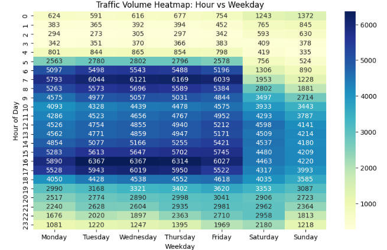

---

# 🚦 Traffic Volume Prediction Flask App


[](https://www.kaggle.com/datasets/anshtanwar/metro-interstate-traffic-volume)


---

## 📚 Table of Contents

1. [Project Overview](#1-project-overview)
   - 1.1 [Objective](#11-objective)
   - 1.2 [Problem Statement](#12-problem-statement)

2. [Project Architectural Diagram](#2-project-architectural-diagram)

3. [Dataset](#3-dataset)
   - 3.1 [Sources](#31-sources)

4. [Dataset Structure](#4-dataset-structure)

5. [Exploratory Data Analysis](#5-exploratory-data-analysis)

6. [Modeling and Evaluation](#6-modeling-and-evaluation)
   - 6.1 [Potential Models](#61-potential-models)
   - 6.2 [Evaluation Metrics](#62-evaluation-metrics)
   - 6.3 [Why These Evaluation Metrics](#63-why-these-evaluation-metrics)
   - 6.4 [Model Performance Comparison](#64-model-performance-comparison)

7. [App Features](#7-app-features)

8. [Project Structure](#8-project-structure)

9. [Getting Started](#9-getting-started)
    - 9.1 [Clone the Repository](#91-clone-the-repository)
    - 9.2 [Navigate to the Project Folder](#92-navigate-to-the-project-folder)

10. [Dependencies / Installation](#10-dependencies--installation)   

11. [Quick Start](#11-quick-start)
    - 11.1 [Test via Browser](#111-test-via-browser)
    - 11.2 [Docker Build](#112-docker-build)
    - 11.3 [Docker Run](#113-docker-run)
    - 11.4 [Test via JSON API](#114-test-via-json-api)

12. [App Preview](#12-app-preview)

13. [Conclusion](#13-conclusion)

14. [License](#14-license)

---

## 1. Project Overview

### 1.1 Objective

The goal of this project is to **predict traffic volume** on westbound I-94, a major interstate highway connecting Minneapolis and St. Paul, Minnesota. Accurate traffic forecasting supports:

* Improved congestion management
* Better traffic planning
* More efficient infrastructure decisions
* Enhanced commuter experience

### 1.2 Problem Statement

Urban roads face unpredictable congestion driven by weather, time of day, and special events.
This project uses **machine learning** to predict future traffic volume based on:

* Weather conditions
* Temporal features
* Holiday indicators

---

## 2. Project Architectural Diagram

### Local Deployment Architecture

This setup runs the entire application (web server and ML model) on your local machine. It is typically used for development, testing, or personal use.


**Step-by-step flow:**

1. **User opens a web browser** (e.g., Chrome or Firefox) and navigates to `http://localhost:9696/` (a local address on the user's machine).

2. **Browser sends an HTTP GET request** to the Flask app running locally to load the main page (`index.html`).  
   - The Flask app serves the `index.html` file from its templates folder.

3. **User interacts with the web page** (e.g., fills in a form with input features) and submits it.

4. **Browser sends an HTTP POST request** to the `/predict` endpoint of the Flask app, including the input data (usually in JSON or form format).

5. **Flask app receives the POST request** at the `/predict` route.

6. **Flask app loads the trained machine learning model** from the file `model_xgb.pkl` (an XGBoost model saved using pickle or joblib).

7. **Flask app uses the loaded model** to make a prediction based on the input data received from the browser.

8. **Flask app creates a JSON response** containing the prediction (e.g., `{"prediction": value}`).

9. **Flask app sends the JSON response back** to the browser.

10. **Browser receives the JSON** and updates the webpage (using JavaScript) to display the prediction result to the user.

**Key characteristics:**  
- Everything runs on the local machine.  
- No internet required after initial setup.  
- Fast response times (no network latency).  
- Not accessible to others unless the machine is exposed to the network.

---

## 3. Dataset

The dataset contains **hourly traffic volume** recorded by MnDOT from **2012–2018** on I-94 between Minneapolis and St. Paul.

### 3.1 Sources

* **Kaggle:** [Metro Interstate Traffic Volume](https://www.kaggle.com/datasets/anshtanwar/metro-interstate-traffic-volume)
* **Direct CSV:** [Metro_Interstate_Traffic_Volume.csv](https://raw.githubusercontent.com/Guilhermertp/machine-learning-zoomcamp2025/refs/heads/main/CapstoneProj/Metro_Interstate_Traffic_Volume.csv)

---

## 4. Dataset Structure

| Feature          | Description                  |
| ---------------- | ---------------------------- |
| `temp`           | Temperature (Kelvin)         |
| `rain_1h`        | Rainfall in last hour (mm)   |
| `snow_1h`        | Snowfall in last hour (cm)   |
| `clouds_all`     | Cloud cover (%)              |
| `holiday`        | Whether the day is a holiday |
| `year`           | Year of observation          |
| `month`          | Month                        |
| `hour`           | Hour                         |
| `traffic_volume` | Target variable              |

---

## 5. Exploratory Data Analysis

### 📊 Average Traffic Volume by Weekday


The **bar chart** highlights clear differences in traffic intensity across the week:

* **Peak Days:** **Thursday** and **Friday** record the highest average traffic volumes, slightly exceeding **3,600**, making them the busiest days overall.
* **Consistently Busy Weekdays:** **Monday**, **Tuesday**, and **Wednesday** also maintain high traffic levels, clustered closely between **3,300 and 3,600**, indicating steady commuter-driven demand throughout the workweek.
* **Weekend Decline:** **Saturday** shows a noticeable drop in traffic (around **2,800**), while **Sunday** experiences the lowest volume of the entire week (near **2,400**).
* **Sharp Transition:** The decline from **Friday to Saturday** is substantial, confirming a strong distinction between weekday commuting traffic and weekend travel behavior.

---

### 🌡️ Traffic Volume Heatmap: Hour vs Weekday



The **heatmap** provides a detailed, granular view of the peak traffic hours and patterns across the days of the week. The darker blue/purple colors represent the highest traffic volumes, while the pale yellow represents the lowest. 

---

#### 1. Weekday (Monday – Friday) Patterns

Weekdays exhibit a **classic commuter traffic profile** with two pronounced peaks:

* **Morning Peak (AM Rush Hour):**

  * Occurs between **7:00 and 9:00**.
  * **8:00** stands out as the busiest morning hour across all weekdays, with volumes exceeding **5,700** and climbing above **6,000** midweek.
* **Evening Peak (PM Rush Hour):**

  * Strongest between **16:00 and 18:00**.
  * **17:00** is the **single busiest hour of the entire week**, reaching the darkest intensities on Wednesday, Thursday, and Friday (above **6,300**).
* **Midday Plateau:** Between **10:00 and 15:00**, traffic dips slightly but remains consistently high (roughly **4,500–5,200**), indicating sustained daytime activity.
* **Overnight Low:** The lowest volumes occur between **0:00 and 5:00**, when traffic is minimal across all weekdays.

---

#### 2. Weekend (Saturday – Sunday) Patterns

Weekend traffic follows a very different rhythm:

* **Saturday:**

  * Traffic increases later in the morning (around **8:00–9:00**).
  * Volumes remain elevated from **10:00 through early evening**, forming a broad, sustained peak rather than sharp rush hours.
  * Peak levels are noticeably lower than weekday PM peaks, reflecting leisure and errand-based travel.
* **Sunday:**

  * Overall traffic is the lightest of the week.
  * Volumes gradually rise late morning and peak between **12:00 and 17:00**, then decline steadily into the evening.
  * Even at its peak, Sunday traffic resembles weekday midday levels rather than rush-hour intensity.

---

#### 3. Key Peak Traffic Hours Summary

| Period      | Day(s)                 | Typical Peak Hours        | Highest Volume Hour |
| ----------- | ---------------------- | ------------------------- | ------------------- |
| **Overall** | **Weekdays (Thu–Fri)** | 16:00 – 18:00             | **17:00 (Evening Rush Hour)**           |
| **AM Peak** | Weekdays               | 7:00 – 9:00               | 8:00                |
| **PM Peak** | Weekdays               | 16:00 – 18:00             | 17:00               |
| **Weekend** | Saturday               | 10:00 – 18:00 (Sustained) | 15:00 – 17:00       |

---

**Overall Insight:**
The combined charts clearly show that traffic demand is **strongly driven by weekday commuting**, with pronounced rush-hour peaks, while weekends feature **lower, more evenly distributed traffic**, dominated by discretionary travel rather than work-related movement.

---

## 6. Modeling and Evaluation

### 6.1 Potential Models

* Linear Regression
* Decision Tree Regressor
* Random Forest Regressor
* Gradient Boosting (XGBoost / LightGBM)

### 6.2 Evaluation Metrics

* **MAE** – average absolute error
* **MSE** – penalizes large errors
* **RMSE** – interpretable version of MSE
* **R² Score** – how much variance is explained

### 6.3 Why These Evaluation Metrics

Traffic volume is a **regression task**, and these metrics:

* Capture average prediction error (MAE)
* Penalize big mistakes (MSE/RMSE)
* Evaluate overall model fit (R²)

### 6.4 Model Performance Comparison

| Model             | MAE     | MSE          | RMSE    | R² Score |
| ----------------- | ------- | ------------ | ------- | -------- |
| Linear Regression | 1577.90 | 3,204,038.54 | 1789.98 | 0.190    |
| Decision Tree     | 293.74  | 257,271.31   | 507.22  | 0.935    |
| Random Forest     | 278.40  | 223,224.67   | 472.47  | 0.944    |
| **XGBoost**       | 268.39  | 212,305.14   | 460.77  | 0.946    |

<b>Best model: <u>XGBoost Regressor</u></b>

---

## 7. App Features

* Predict traffic with any regression model
* Simple Flask web UI
* JSON API endpoint
* Fully Dockerized

---
## 8. Project Structure

```
project_folder/
│
├─ app.py
├─ model.pkl
├─ Dockerfile
├─ requirements.txt
├─ EDA.ipynb
├─ train.py
│
├─ assets/
│  ├─ app.png
│  ├─ architecture.png
│  ├─ barchart.png
│  └─ heatmap.png
│
└─ templates/
   └─ index.html
```
---

## 9. Getting Started

To reproduce or test this project, follow these steps:

### 9.1 Clone the Repository

Clone the repository to your local machine:

```bash
git clone https://github.com/Guilhermertp/machine-learning-zoomcamp2025.git
```

### 9.2 Navigate to the Project Folder

You only need the **CapstoneProj** folder to run this app. Move into the folder:

```bash
cd machine-learning-zoomcamp2025/CapstoneProj
```

All necessary files, including the dataset, are included in this folder.

---

## 10. Dependencies / Installation

* **Python 3.13**

It’s recommended to use a virtual environment. Install the required Python packages with the specified versions:

```bash
pip install Flask==3.1.2 scikit-learn==1.7.2 joblib==1.5.2 lightgbm==4.6.0 pandas==2.3.3 numpy==2.3.3 xgboost==3.1.0
```

---

## 11. Quick Start

You can test the app in multiple ways:

### 11.1 Test via Browser

Run the app locally with Python:

```bash
python predict.py
```

Then open your browser and visit: [http://127.0.0.1:9696/](http://127.0.0.1:9696/)

---


### 11.2 Docker Build

> **⚠️ Make sure Docker Desktop is running** on your machine before running the build command. The Docker daemon must be active, or the build will fail.


Build the Docker image:

```bash
docker build -t flask-ml-api .
```

---

### 11.3 Docker Run

Run the Docker container:

```bash
docker run -p 9696:9696 flask-ml-api
```
Access:

```
http://127.0.0.1:9696/
```

---


---

### 11.4 Test via JSON API

You can send a JSON request directly to the API:

#### Testing the `/predict` Endpoint with `curl` on Windows

> **Note:** Before running this command, make sure your Flask server is running:
> 
> - Either locally: `python app.py`
> - Or in Docker: after building the image, run `docker run -p 9696:9696 flask-ml-api`

---

#### Example `curl` Command (Windows Command Prompt)

This command sends **all 13 features** that the XGBoost model expects:

```cmd
curl -X POST http://localhost:9696/predict -H "Content-Type: application/json" -d "{\"temp\":298.15,\"rain_1h\":0,\"snow_1h\":0,\"clouds_all\":75,\"hour\":14,\"is_holiday\":0,\"weekday_Friday\":0,\"weekday_Monday\":0,\"weekday_Saturday\":0,\"weekday_Sunday\":0,\"weekday_Thursday\":0,\"weekday_Tuesday\":1,\"weekday_Wednesday\":0}"
```

---

## Notes

* Make sure you are in the **CapstoneProj** folder before running any commands.
* The dataset is already included, so no separate download is required.

---

## 12. App Preview

### 12.1 Web Form Submission and prediction


---

## 13. Conclusion

This project demonstrates the practical application of **machine learning for traffic volume prediction** on I-94 between Minneapolis and St. Paul. By leveraging temporal, weather, holiday, and one-hot encoded weekday features, the model provides **accurate hourly forecasts** that can inform congestion management and city planning.

Among the models tested, **XGBoost achieved the best performance** with an RMSE of **460.77** and an R² of **0.946**, effectively capturing the strong weekday commuting patterns and weekend traffic variations observed in the dataset.

Overall, this Flask app—fully deployable locally or via Docker—offers a **ready-to-use tool for interactive predictions**, illustrating how data-driven insights can enhance traffic monitoring and decision-making.

---

## 14. License

MIT License
Author: **Guilherme Pereira**
Project: **Traffic Volume Prediction App**

---
