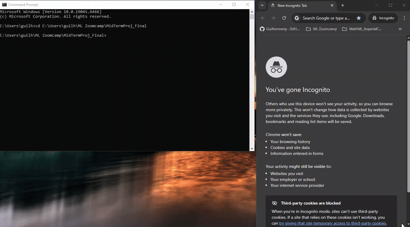
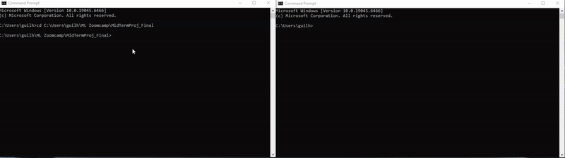
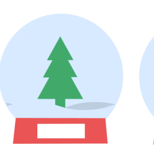

# 🌊 Tsunami Prediction Flask App


A **Flask web application** for predicting tsunamis using a **LightGBM** model.
Supports both a **web form UI** and a **JSON API**. Docker setup included for easy deployment.

---

## 📚 Table of Contents

* [Features](#-features)
* [Prerequisites](#-prerequisites)
* [Project Structure](#-project-structure)
* [Quick Start](#-quick-start)

  * [1️⃣ Test via Browser](#1️⃣-test-via-browser)
  * [2️⃣ Docker Build](#2️⃣-docker-build)
  * [3️⃣ Docker Run](#3️⃣-docker-run)
  * [4️⃣ Test via JSON API](#4️⃣-test-via-json-api)
* [Demo GIFs](#-demo-gifs)
* [License](#-license)

---

## 🚀 Features

* Predict tsunami occurrence & probability from earthquake features
* Clean and minimal HTML form
* JSON endpoint for programmatic access
* Fully Dockerized

---

## 🧰 Prerequisites

* **Python 3.13**
* Required Python packages:

```bash
pip install \
    Flask==3.1.2 \
    numpy==2.3.1 \
    pandas==2.3.1 \
    joblib \
    scikit-learn==1.7.0 \
    lightgbm==4.6.0
```

* Docker (optional)

---

## 📁 Project Structure

```
project_folder/
│
├─ predict.py              # Flask application
├─ lgbm_model.pkl          # Trained LightGBM model
│
├─ assets/                 # Demo GIFs
│  ├─ demo-form.gif
│  ├─ demo-docker.gif
│  └─ demo-result.gif
│
└─ templates/
   └─ index.html           # HTML form
```

---

# 🚀 Quick Start

---

## 1️⃣ Test via Browser

Run the Flask app:

```bash
python predict.py
```

Open:

```
http://127.0.0.1:9696/
```

Sample input:

```json
{
  "magnitude": 7.0,
  "cdi": 8,
  "mmi": 7,
  "sig": 768,
  "nst": 117,
  "dmin": 0.509,
  "gap": 17.0,
  "depth": 14.0,
  "latitude": -9.7963,
  "longitude": 159.596,
  "Year": 2022,
  "Month": 11
}
```

### Minimal `index.html`

```html
<!DOCTYPE html>
<html>
<head>
    <title>Tsunami Prediction</title>
</head>
<body>
    <h1>Tsunami Prediction Form</h1>
    <form action="/predict" method="post">
        <label>Magnitude: <input type="text" name="magnitude"></label><br>
        <label>CDI: <input type="text" name="cdi"></label><br>
        <label>MMI: <input type="text" name="mmi"></label><br>
        <label>SIG: <input type="text" name="sig"></label><br>
        <label>NST: <input type="text" name="nst"></label><br>
        <label>Dmin: <input type="text" name="dmin"></label><br>
        <label>Gap: <input type="text" name="gap"></label><br>
        <label>Depth: <input type="text" name="depth"></label><br>
        <label>Latitude: <input type="text" name="latitude"></label><br>
        <label>Longitude: <input type="text" name="longitude"></label><br>
        <label>Year: <input type="text" name="Year"></label><br>
        <label>Month: <input type="text" name="Month"></label><br>
        <input type="submit" value="Predict">
    </form>

    
        <h2>Prediction Result:</h2>
        <p>Predicted Tsunami:
             Tsunami  No Tsunami 
        </p>
        <p>Probability: {{ prediction.probability }}</p>
    
</body>
</html>
```

---

## 2️⃣ Docker Build

```bash
docker build -t lightgbm-api .
```

---

## 3️⃣ Docker Run

```bash
docker run -p 9696:9696 lightgbm-api
```

Access:

```
http://127.0.0.1:9696/
```

---

## 4️⃣ Test via JSON API

```bash
curl -X POST http://127.0.0.1:9696/predict \
     -H "Content-Type: application/json" \
     -d '{"magnitude":7.0,"cdi":8,"mmi":7,"sig":768,"nst":117,"dmin":0.509,"gap":17.0,"depth":14.0,"latitude":-9.7963,"longitude":159.596,"Year":2022,"Month":11}'
```

---

## 🎞 Demo GIFs

1️⃣ Web Form Submission

2️⃣ Prediction Result

3️⃣ Dockerized App Running



---

## 📜 License

MIT License
Author: **Guilherme Pereira**
Project: **Tsunami Prediction API**

---